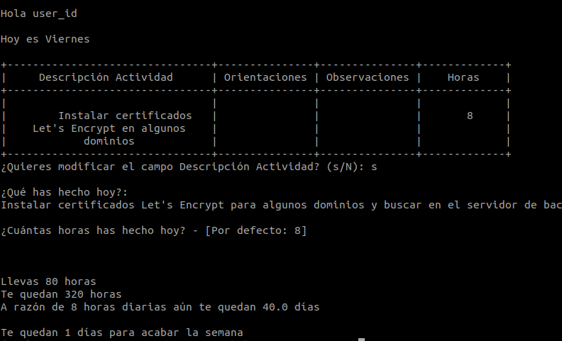

# fct-sao-client

---

Script que accede a FCT SAO mediante selenium y chrome webdriver

Inicia sesión con los datos que lee de los ficheros `user.txt` y `cp.txt`

Selecciona el día de la semana en el que estamos

Pide por terminal el texto a introducir en el input "Descripción Actividad"

Pide por terminal las horas realizadas el día de hoy

Envía los datos y cierra sesión

## Mejoras

- [x] Mostrar información: horas realizadas, horas que quedan
- [x] Dar la bienvenida
- [x] Comprobar si hay algo escrito en los campos y preguntar si se quiere borrar o modificar
- [ ] Mostrar toda la semana
- [ ] Poner el webdriver en modo headless (lo último)

## Instalación

Clonar este repositorio o descargar zip

En requirements.txt modificar la versión de chromedriver-py con la del navegador google chrome instalado en tu sistema.
https://pypi.org/project/chromedriver-py/#history

Crear un virtualenv `python3 -m venv env`

Acceder a él `source env/bin/activate`

Instalar dependencias `python3 -m pip install -r requirements.txt`

Ejecutar script
